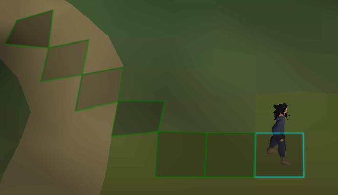
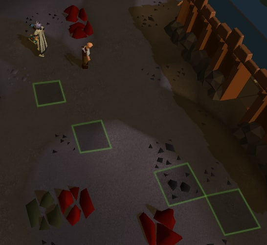

# Pathfinder
  
Highlights the path your character will take to the hovered unobstructed tile. Ideal for situations like Zalcano (avoiding red symbols) and Gauntlet (avoiding tornadoes and stomps.)

  
Also supports showing only tiles you actually stand on while running!

# Usage
Simply enable the plugin "Pathfinder" in your configuration tab. You can also configure the path display to switch on and off with a keybind (default Ctrl-Z on Windows, Cmd-Z on Mac.).
Check your settings to enable "skip jumped tiles" to only show tiles you touch while running.

# Contact me
Feel free to create issues on the [project GitHub](https://github.com/wqferr/pathfinder). Please note that pathfinding around obstacles is **not** planned.